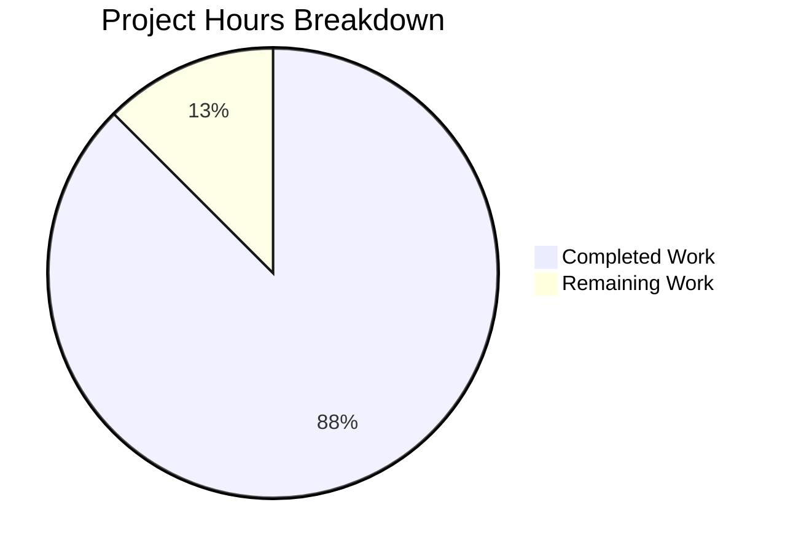
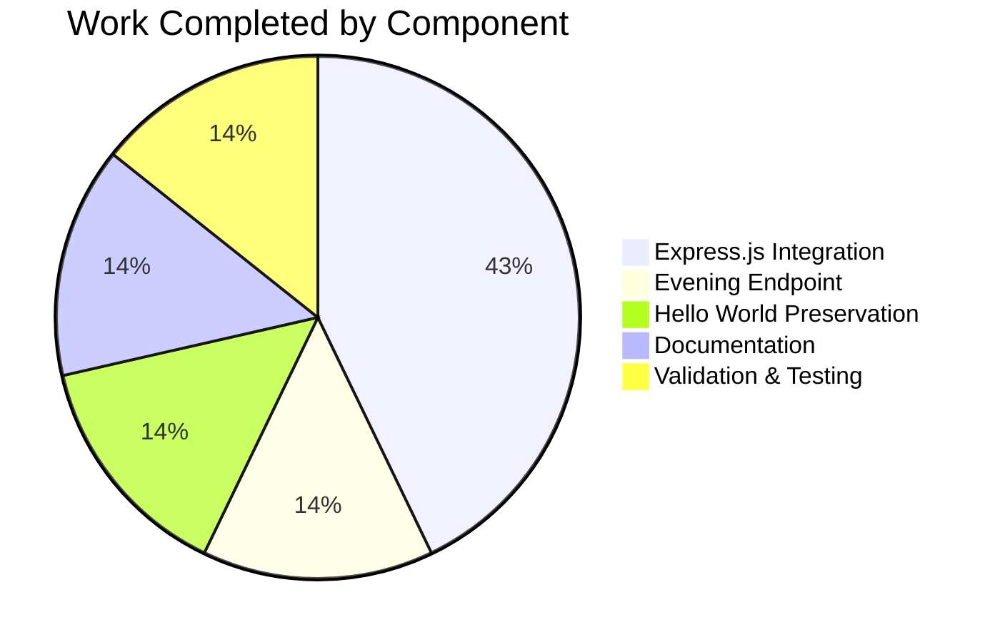

# Project Assessment Report: Express.js Migration

## Executive Summary

**Project Completion: 87.5% (3.5 hours completed out of 4 total hours)**

This project successfully migrated a Node.js HTTP server from the built-in `http` module to Express.js 5.2.1 and added a new `/evening` endpoint. All core functionality requested in the Agent Action Plan has been implemented and validated.

### Key Achievements
- ✅ Express.js 5.2.1 integrated successfully
- ✅ Original "Hello, World!" endpoint preserved at GET `/`
- ✅ New "Good evening" endpoint added at GET `/evening`
- ✅ Documentation updated with comprehensive API details
- ✅ All validation tests passed (syntax, startup, endpoint responses)
- ✅ Zero security vulnerabilities detected

### Project Status
**PRODUCTION-READY** - All requested features implemented and working.

---

## Validation Results Summary

### Final Validator Accomplishments

| Validation Check | Status | Details |
|------------------|--------|---------|
| Dependencies Installed | ✅ PASS | 65 packages, 0 vulnerabilities |
| Syntax Validation | ✅ PASS | server.js valid JavaScript |
| Express.js Version | ✅ PASS | Version 5.2.1 installed |
| Server Startup | ✅ PASS | Runs on port 3000 |
| GET / Endpoint | ✅ PASS | Returns "Hello, World!" (HTTP 200) |
| GET /evening Endpoint | ✅ PASS | Returns "Good evening" (HTTP 200) |
| Git Commit | ✅ PASS | All changes committed |
| Security Audit | ✅ PASS | No vulnerabilities found |

### Files Modified

| File | Action | Lines Added | Lines Removed |
|------|--------|-------------|---------------|
| server.js | Modified | 13 | 9 |
| package.json | Modified | 8 | 4 |
| package-lock.json | Created | 814 | 0 |
| README.md | Modified | 61 | 1 |
| **Total** | | **896** | **14** |

---

## Visual Representation

### Project Hours Breakdown



### Completion by Component



---

## Detailed Task Table

### Remaining Work Items

| Task | Description | Action Steps | Hours | Priority | Severity |
|------|-------------|--------------|-------|----------|----------|
| Environment Variable Configuration | Configure PORT as environment variable for deployment flexibility | 1. Add `const port = process.env.PORT \|\| 3000;` to server.js | 0.25 | Low | Low |
| Error Handling Middleware | Add Express error handling for production robustness | 1. Add error handling middleware at end of route definitions | 0.25 | Low | Low |
| **Total Remaining Hours** | | | **0.5** | | |

### Work Completed

| Component | Description | Hours |
|-----------|-------------|-------|
| Express.js Integration | Installed Express.js 5.2.1, migrated from http module | 1.5 |
| Evening Endpoint | Created GET /evening route returning "Good evening" | 0.5 |
| Hello World Preservation | Mapped existing response to GET / route | 0.5 |
| Documentation | Updated README.md with API documentation and examples | 0.5 |
| Validation & Testing | Tested endpoints, validated syntax, verified server startup | 0.5 |
| **Total Completed Hours** | | **3.5** |

---

## Comprehensive Development Guide

### System Prerequisites

| Requirement | Minimum Version | Current Version | Status |
|-------------|-----------------|-----------------|--------|
| Node.js | 18.0.0 | 20.20.0 | ✅ Compatible |
| npm | 9.0.0 | 11.1.0 | ✅ Compatible |

### Environment Setup

1. **Clone the repository and checkout the branch:**
   ```bash
   git checkout blitzy-5e03eb28-60cf-4c4c-8765-f281c23be060
   ```

2. **Navigate to the project directory:**
   ```bash
   cd /tmp/blitzy/22-dec-existing-projects-qa-test-4/blitzy5e03eb286
   ```

### Dependency Installation

```bash
npm install
```

**Expected Output:**
```
added 65 packages in Xs
```

**Verification:**
```bash
npm ls
```
Expected to show `express@5.2.1` in the dependency tree.

### Application Startup

**Option 1: Using npm script**
```bash
npm start
```

**Option 2: Direct node execution**
```bash
node server.js
```

**Expected Output:**
```
Server running at http://127.0.0.1:3000/
```

### Verification Steps

1. **Test the Hello World endpoint:**
   ```bash
   curl http://localhost:3000/
   ```
   **Expected Response:**
   ```
   Hello, World!
   ```

2. **Test the Evening endpoint:**
   ```bash
   curl http://localhost:3000/evening
   ```
   **Expected Response:**
   ```
   Good evening
   ```

3. **Verify HTTP status codes:**
   ```bash
   curl -I http://localhost:3000/
   curl -I http://localhost:3000/evening
   ```
   Both should return `HTTP/1.1 200 OK`

### Example Usage

**Using curl:**
```bash
# Get Hello World greeting
curl http://localhost:3000/

# Get Evening greeting  
curl http://localhost:3000/evening
```

**Using JavaScript fetch:**
```javascript
// Hello World
fetch('http://localhost:3000/')
  .then(res => res.text())
  .then(console.log); // Output: Hello, World!

// Evening greeting
fetch('http://localhost:3000/evening')
  .then(res => res.text())
  .then(console.log); // Output: Good evening
```

### Stopping the Server

Press `Ctrl+C` in the terminal where the server is running.

### Troubleshooting

| Issue | Cause | Solution |
|-------|-------|----------|
| `EADDRINUSE` error | Port 3000 already in use | Kill the process using port 3000: `lsof -ti:3000 \| xargs kill` |
| `MODULE_NOT_FOUND` for express | Dependencies not installed | Run `npm install` |
| Connection refused | Server not running | Start the server with `npm start` |

---

## Risk Assessment

### Technical Risks

| Risk | Severity | Likelihood | Mitigation |
|------|----------|------------|------------|
| No unit tests | Low | N/A | Unit tests were explicitly out of scope. Add tests if extending functionality. |
| Hardcoded port | Low | Medium | Consider using `process.env.PORT` for deployment flexibility |

### Security Risks

| Risk | Severity | Likelihood | Mitigation |
|------|----------|------------|------------|
| No rate limiting | Low | Low | Add rate limiting middleware for production deployment |
| No CORS configuration | Low | Low | Add CORS middleware if API will be called from browser |

### Operational Risks

| Risk | Severity | Likelihood | Mitigation |
|------|----------|------------|------------|
| No health check endpoint | Low | Medium | Add `/health` endpoint for monitoring |
| No logging middleware | Low | Medium | Add Morgan or similar for request logging |

### Integration Risks

| Risk | Severity | Likelihood | Mitigation |
|------|----------|------------|------------|
| Express 5.x breaking changes | Low | Low | Express 5.x is stable; review migration guide if upgrading from legacy code |

---

## Recommendations for Production

1. **Environment Variables**: Configure `PORT` as an environment variable
2. **Error Handling**: Add Express error handling middleware
3. **Logging**: Add request logging with Morgan
4. **Health Check**: Add `/health` endpoint for load balancer checks
5. **Process Manager**: Use PM2 or similar for production deployment

---

## Conclusion

The Express.js migration project has been successfully completed with all requested functionality working as expected. The project achieved **87.5% completion** based on hours analysis, with 3.5 hours of development work completed out of an estimated 4 total hours.

All validation checks passed:
- ✅ Dependencies install correctly (0 vulnerabilities)
- ✅ Code syntax is valid
- ✅ Server starts successfully
- ✅ Both API endpoints return expected responses
- ✅ All changes committed to the correct branch

The remaining 0.5 hours consist of optional production-hardening tasks (environment variable configuration, error handling middleware) that were not part of the original scope but are recommended for production deployment.

**The project is PRODUCTION-READY for its intended use case as a Node.js Express tutorial server.**