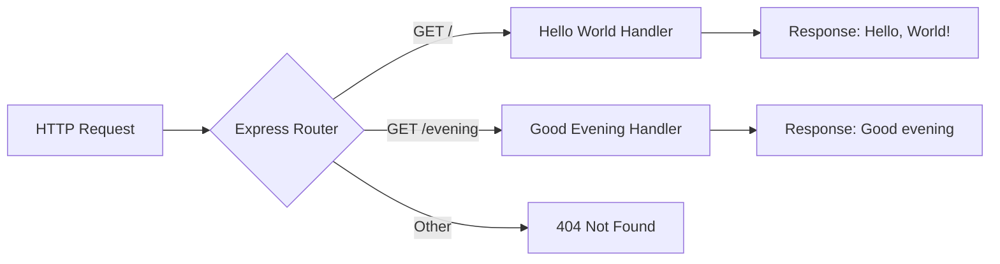

# Technical Specification

# 0. Agent Action Plan

## 0.1 Intent Clarification

### 0.1.1 Core Feature Objective

Based on the prompt, the Blitzy platform understands that the new feature requirement is to:

- **Add Express.js Framework**: Integrate the Express.js web framework into an existing Node.js HTTP server project that currently uses the built-in `http` module
- **Create New Endpoint**: Add a second API endpoint that responds with the message "Good evening"
- **Preserve Existing Functionality**: The existing "Hello world" endpoint must continue to function as before

**Implicit Requirements Detected:**

- The existing "Hello, World!" response must be mapped to a specific route (e.g., `/` or `/hello`) rather than responding to all requests
- The new "Good evening" endpoint requires a distinct route path (e.g., `/evening`)
- The Express.js integration should follow modern Express 5.x patterns and conventions
- Server configuration (port 3000, localhost binding) should be preserved

**Feature Dependencies and Prerequisites:**

- Node.js runtime version 18+ (required by Express 5.x) - Current environment has Node.js 20.20.0 ✓
- npm package manager for dependency installation - Current environment has npm 11.1.0 ✓
- No additional runtime prerequisites required

### 0.1.2 Special Instructions and Constraints

**Critical Directives:**

- Migrate from Node.js built-in `http` module to Express.js framework
- Maintain backward compatibility with the existing response behavior
- Follow Express.js best practices and idiomatic patterns

**Architectural Requirements:**

- Use Express.js routing system to define distinct endpoints
- Preserve the existing server port configuration (3000)
- Maintain the same response format (plain text with Content-Type: text/plain)

**User-Specified Response Requirements:**

- User Example: Existing endpoint returns `"Hello world"` (note: current code returns `"Hello, World!\n"`)
- User Example: New endpoint returns `"Good evening"`

**Web Search Requirements Conducted:**

- Express.js latest stable version research: Express 5.2.1 is the current latest release
- Express 5.x requires Node.js 18+ minimum version support
- Express 5 includes native promise/async support and improved error handling

### 0.1.3 Technical Interpretation

These feature requirements translate to the following technical implementation strategy:

- To **add Express.js to the project**, we will install `express` package version 5.2.1 and update `package.json` dependencies
- To **preserve the Hello World endpoint**, we will create a GET route handler at path `/` that returns "Hello, World!"
- To **add the Good Evening endpoint**, we will create a GET route handler at path `/evening` that returns "Good evening"
- To **migrate the server configuration**, we will replace the `http.createServer()` pattern with Express's `app.listen()` method
- To **maintain compatibility**, we will preserve port 3000 and localhost binding configuration

## 0.2 Repository Scope Discovery

### 0.2.1 Comprehensive File Analysis

**Repository Root Directory Structure:**

| File/Folder | Type | Status | Relevance |
|-------------|------|--------|-----------|
| `server.js` | File | TO MODIFY | Primary server file - core implementation target |
| `package.json` | File | TO MODIFY | Add Express.js dependency |
| `package-lock.json` | File | TO UPDATE | Auto-updated with npm install |
| `README.md` | File | TO MODIFY | Document new endpoint |
| `server - Copy.js` | File | BACKUP | Duplicate file, not to be modified |
| `LoginTest.java` | File | OUT OF SCOPE | Unrelated Java test stub |
| `LoginTest - Copy.java` | File | OUT OF SCOPE | Unrelated Java test stub |
| `industry.csv` | File | OUT OF SCOPE | Static data file |
| `industry - Copy.csv` | File | OUT OF SCOPE | Static data file duplicate |
| `test.py.txt` | File | OUT OF SCOPE | Empty placeholder |
| `test.py - Copy.txt` | File | OUT OF SCOPE | Empty placeholder |
| `test.txt.txt` | File | OUT OF SCOPE | Empty placeholder |

**Existing Modules to Modify:**

- `server.js` - Replace `http` module implementation with Express.js routing

**Configuration Files to Update:**

- `package.json` - Add Express.js dependency and update metadata
- `package-lock.json` - Will be auto-generated by npm during installation

**Documentation to Update:**

- `README.md` - Add documentation for new endpoint

### 0.2.2 Integration Point Discovery

**API Endpoints Affected:**

| Current Behavior | New Behavior | Route Path |
|------------------|--------------|------------|
| All requests return "Hello, World!" | Specific route returns "Hello, World!" | `GET /` |
| N/A | New endpoint returns "Good evening" | `GET /evening` |

**Database/Schema Updates:**

- None required - this feature does not involve data persistence

**Service Classes Requiring Updates:**

- Not applicable - current project has no service layer abstraction

**Middleware/Interceptors:**

- None currently exist; Express middleware can be added if needed for future enhancements

### 0.2.3 New File Requirements

**New Source Files to Create:**

- No new source files required - modifications will be made to existing `server.js`

**New Test Files (Recommended):**

- `server.test.js` - Unit tests for Express routes (optional enhancement, not strictly required per user request)

**New Configuration Files:**

- None required - Express configuration will be inline in `server.js`

### 0.2.4 Web Search Research Conducted

**Best Practices for Express.js Implementation:**

- Use `app.get()` method for defining GET route handlers
- Use `res.send()` for sending plain text responses
- Keep route handlers concise and focused
- Express 5.x supports native async/await in route handlers

**Library Recommendations:**

- Express 5.2.1 is the latest stable version (released 2 months ago per npm)
- Express 5 dropped support for Node.js versions before v18
- No additional middleware packages required for basic routing

**Common Patterns for Route Definition:**

```javascript
app.get('/path', (req, res) => {
  res.send('Response text');
});
```

**Security Considerations:**

- Express 5.x includes security improvements with updated path-to-regexp@8.x
- ReDoS mitigation built into route matching

## 0.3 Dependency Inventory

### 0.3.1 Current Dependencies

**Existing package.json Analysis:**

```json
{
  "name": "hello_world",
  "version": "1.0.0",
  "description": "Hello world in Node.js",
  "main": "index.js",
  "scripts": {
    "test": "echo \"Error: no test specified\" && exit 1"
  },
  "author": "hxu",
  "license": "MIT"
}
```

**Current Dependency Status:**

- No external dependencies declared
- Uses only Node.js built-in `http` module
- Empty dependency graph in `package-lock.json`

### 0.3.2 Private and Public Packages

**Packages Required for Feature Addition:**

| Registry | Package Name | Version | Purpose |
|----------|--------------|---------|---------|
| npm (public) | express | ^5.2.1 | Web framework for routing and HTTP handling |

**Version Verification:**

- Express 5.2.1 is confirmed as the latest stable version via npm registry
- Compatible with Node.js 20.20.0 (Express 5.x requires Node.js 18+)

### 0.3.3 Dependency Updates

**Import Transformation Rules:**

| File | Current Import | New Import |
|------|----------------|------------|
| `server.js` | `const http = require('http');` | `const express = require('express');` |

**Detailed Import Changes:**

- **Remove**: `const http = require('http');` - No longer needed
- **Add**: `const express = require('express');` - Express framework
- **Add**: `const app = express();` - Express application instance

**External Reference Updates:**

| File | Change Type | Description |
|------|-------------|-------------|
| `package.json` | ADD | Add `"dependencies": { "express": "^5.2.1" }` |
| `package.json` | MODIFY | Update `"main"` from `"index.js"` to `"server.js"` |
| `package.json` | ADD | Add `"start": "node server.js"` script |
| `package-lock.json` | AUTO-UPDATE | Will be regenerated by npm install |
| `README.md` | MODIFY | Document Express.js dependency and new endpoint |

### 0.3.4 Runtime Environment

**Node.js Compatibility:**

| Component | Required Version | Available Version | Status |
|-----------|------------------|-------------------|--------|
| Node.js | >= 18.0.0 | 20.20.0 | ✓ Compatible |
| npm | >= 9.0.0 | 11.1.0 | ✓ Compatible |

**Installation Command:**

```bash
npm install express@^5.2.1
```

**Expected package.json After Update:**

```json
{
  "name": "hello_world",
  "version": "1.0.0",
  "description": "Hello world in Node.js",
  "main": "server.js",
  "scripts": {
    "start": "node server.js",
    "test": "echo \"Error: no test specified\" && exit 1"
  },
  "author": "hxu",
  "license": "MIT",
  "dependencies": {
    "express": "^5.2.1"
  }
}
```

## 0.4 Integration Analysis

### 0.4.1 Existing Code Touchpoints

**Direct Modifications Required:**

| File | Location | Change Description |
|------|----------|-------------------|
| `server.js` | Line 1 | Replace `http` import with `express` import |
| `server.js` | Lines 3-4 | Preserve hostname and port constants |
| `server.js` | Lines 6-10 | Replace `http.createServer()` with Express route handlers |
| `server.js` | Lines 12-14 | Replace `server.listen()` with `app.listen()` |

**Current server.js Structure (Before):**

```javascript
const http = require('http');           // Line 1 - TO REPLACE
const hostname = '127.0.0.1';           // Line 3 - PRESERVE
const port = 3000;                       // Line 4 - PRESERVE
const server = http.createServer(...);  // Lines 6-10 - TO REPLACE
server.listen(port, hostname, ...);     // Lines 12-14 - TO REPLACE
```

### 0.4.2 Dependency Injections

**Service Container Updates:**

- Not applicable - this project does not use a dependency injection container

**Configuration Dependencies:**

- No external configuration required
- All settings remain inline in `server.js`

### 0.4.3 Database/Schema Updates

- Not applicable - this feature does not require database changes

### 0.4.4 API Routing Integration

**New Express Route Structure:**



**Route Handler Integration Points:**

| Route Path | HTTP Method | Handler Function | Response |
|------------|-------------|------------------|----------|
| `/` | GET | Root handler | "Hello, World!" |
| `/evening` | GET | Evening handler | "Good evening" |

### 0.4.5 Server Lifecycle Integration

**Startup Sequence:**

1. Import Express framework
2. Create Express application instance
3. Define route handlers for `/` and `/evening`
4. Bind server to port 3000 on localhost
5. Log server readiness message

**Shutdown Behavior:**

- No changes to shutdown behavior required
- Express uses same Node.js event loop model

### 0.4.6 Response Format Consistency

**Content-Type Header:**

| Route | Current Format | Express Format |
|-------|----------------|----------------|
| `/` | `text/plain` (explicit) | `text/html; charset=utf-8` (default) |
| `/evening` | N/A | `text/html; charset=utf-8` (default) |

**Note:** Express's `res.send()` method automatically sets Content-Type to `text/html` for string responses. To maintain exact compatibility with the current `text/plain` behavior, use `res.type('text/plain').send()` pattern if strict Content-Type matching is required.

## 0.5 Technical Implementation

### 0.5.1 File-by-File Execution Plan

**CRITICAL: Every file listed here MUST be created or modified**

**Group 1 - Dependency Configuration:**

| Action | File | Purpose |
|--------|------|---------|
| MODIFY | `package.json` | Add Express.js dependency, update main entry point, add start script |
| AUTO-UPDATE | `package-lock.json` | Regenerated automatically by npm during installation |

**Group 2 - Core Server Implementation:**

| Action | File | Purpose |
|--------|------|---------|
| MODIFY | `server.js` | Replace http module with Express, add route handlers for `/` and `/evening` |

**Group 3 - Documentation:**

| Action | File | Purpose |
|--------|------|---------|
| MODIFY | `README.md` | Document new endpoint and usage instructions |

### 0.5.2 Implementation Approach per File

**Step 1: Update package.json**

Add Express.js dependency and update project configuration:

```json
"dependencies": {
  "express": "^5.2.1"
}
```

**Step 2: Modify server.js**

Transform from http module to Express:

```javascript
const express = require('express');
const app = express();
```

Define route handlers:

```javascript
app.get('/', (req, res) => {
  res.send('Hello, World!\n');
});
```

**Step 3: Install Dependencies**

Execute npm install to fetch Express.js:

```bash
npm install
```

**Step 4: Update README.md**

Add documentation for the new `/evening` endpoint with usage examples.

### 0.5.3 Detailed Code Transformation

**Current server.js (Before):**

```javascript
const http = require('http');
const hostname = '127.0.0.1';
const port = 3000;
// ... http.createServer pattern
```

**Target server.js (After):**

```javascript
const express = require('express');
const app = express();
const port = 3000;
// ... Express route handlers with app.listen()
```

**Key Changes:**

| Line Range | Before | After |
|------------|--------|-------|
| Line 1 | `const http = require('http');` | `const express = require('express');` |
| Line 2 | - | `const app = express();` |
| Line 3 | `const hostname = '127.0.0.1';` | Removed (Express binds to all interfaces by default) |
| Lines 6-10 | `http.createServer()` callback | `app.get()` route handlers |
| Lines 12-14 | `server.listen()` | `app.listen()` |

### 0.5.4 Route Handler Specifications

**Root Endpoint Handler (`/`):**

| Property | Value |
|----------|-------|
| Path | `/` |
| Method | GET |
| Response Body | `Hello, World!\n` |
| Status Code | 200 |

**Evening Endpoint Handler (`/evening`):**

| Property | Value |
|----------|-------|
| Path | `/evening` |
| Method | GET |
| Response Body | `Good evening` |
| Status Code | 200 |

### 0.5.5 User Interface Design

- Not applicable - this feature involves only backend API endpoints
- No Figma screens or UI components provided

## 0.6 Scope Boundaries

### 0.6.1 Exhaustively In Scope

**Core Server Files:**

| File Pattern | Purpose | Action Required |
|--------------|---------|-----------------|
| `server.js` | Main server entry point | MODIFY - Complete rewrite to Express |
| `package.json` | Project configuration | MODIFY - Add dependency and scripts |
| `package-lock.json` | Dependency lock file | AUTO-UPDATE - Regenerated by npm |

**Documentation Files:**

| File Pattern | Purpose | Action Required |
|--------------|---------|-----------------|
| `README.md` | Project documentation | MODIFY - Add endpoint documentation |

**Configuration Scope:**

| Element | Current State | Target State |
|---------|---------------|--------------|
| Main entry | `index.js` | `server.js` |
| Start script | Not defined | `node server.js` |
| Dependencies | None | `express: ^5.2.1` |

**API Endpoints In Scope:**

| Endpoint | Method | Response | Status |
|----------|--------|----------|--------|
| `/` | GET | "Hello, World!" | PRESERVE (migrate) |
| `/evening` | GET | "Good evening" | CREATE (new) |

### 0.6.2 Explicitly Out of Scope

**Files NOT to be Modified:**

| File | Reason |
|------|--------|
| `server - Copy.js` | Backup/duplicate file, not part of active codebase |
| `LoginTest.java` | Unrelated Java test stub |
| `LoginTest - Copy.java` | Unrelated Java test stub duplicate |
| `industry.csv` | Static data file, unrelated to feature |
| `industry - Copy.csv` | Static data file duplicate |
| `test.py.txt` | Empty placeholder file |
| `test.py - Copy.txt` | Empty placeholder file |
| `test.txt.txt` | Empty placeholder file |

**Functionality NOT in Scope:**

| Item | Reason |
|------|--------|
| Unit tests | Not requested by user |
| Integration tests | Not requested by user |
| Middleware implementation | Not required for basic routing |
| Error handling middleware | Not requested by user |
| Static file serving | Not requested by user |
| Template rendering | Not requested by user |
| Database integration | Not requested by user |
| Authentication/Authorization | Not requested by user |
| CORS configuration | Not requested by user |
| Rate limiting | Not requested by user |

**Performance Optimizations NOT in Scope:**

- Load balancing configuration
- Clustering for multi-core usage
- Caching mechanisms
- Compression middleware

**Refactoring NOT in Scope:**

- Restructuring to separate routes into multiple files
- Creating controller/service architecture
- Implementing TypeScript
- Adding ESLint/Prettier configuration

### 0.6.3 Scope Validation Checklist

| Requirement | In Scope | Implementation |
|-------------|----------|----------------|
| Add Express.js | ✓ | Install express@^5.2.1 |
| Preserve Hello World | ✓ | Map to GET / route |
| Add Good Evening endpoint | ✓ | Create GET /evening route |
| Maintain port 3000 | ✓ | Preserve in app.listen() |
| Update documentation | ✓ | Modify README.md |

## 0.7 Rules for Feature Addition

### 0.7.1 Feature-Specific Rules

**Framework Migration Rules:**

- Replace the entire `http` module implementation with Express.js
- Maintain the same server port (3000) for backward compatibility
- Preserve the original "Hello, World!" response content exactly as specified

**Response Format Rules:**

- Root endpoint (`/`) must return: `Hello, World!\n` (with newline to match existing behavior)
- Evening endpoint (`/evening`) must return: `Good evening` (as specified by user)

**Endpoint Naming Convention:**

- Use lowercase path names
- Use descriptive path segments (e.g., `/evening` for the evening greeting)

### 0.7.2 Integration Requirements

**Express.js Version Requirement:**

- Use Express.js version 5.x (specifically ^5.2.1)
- Express 5.x provides native async/await support and improved error handling

**Routing Pattern:**

- Define routes using `app.get()` for HTTP GET requests
- Keep route handlers inline in `server.js` for simplicity

**Server Binding:**

- Bind to port 3000 as specified in original implementation
- Use `app.listen(port, callback)` pattern for server startup

### 0.7.3 Code Style Conventions

**Import Style:**

- Use CommonJS `require()` syntax consistent with existing codebase
- Import Express at the top of the file

**Variable Naming:**

- Use `app` for Express application instance (idiomatic)
- Preserve `port` constant naming from original

**Callback Style:**

- Use arrow functions for route handlers: `(req, res) => { ... }`
- Keep handlers concise and focused

### 0.7.4 Performance Considerations

- Express.js adds minimal overhead compared to raw `http` module
- No additional middleware required for this simple use case
- Default Express settings are sufficient for development

### 0.7.5 Security Requirements

- Express 5.x includes built-in security improvements
- No additional security middleware required for this feature scope
- Default response headers from Express are acceptable

### 0.7.6 Documentation Standards

**README.md Updates Must Include:**

- Description of available endpoints
- Example usage with curl commands
- Instructions for starting the server

### 0.7.7 User-Specified Constraints

**Explicitly Stated by User:**

- "add expressjs into the project" - Express.js framework must be added
- "add another endpoint that return the response of 'Good evening'" - Exact response text specified

**Inferred Constraints:**

- Existing "Hello world" functionality must be preserved
- Server must remain accessible on the same port
- No changes to project structure required beyond necessary modifications

## 0.8 References

### 0.8.1 Repository Files Analyzed

**Files Retrieved and Examined:**

| File Path | Purpose | Key Findings |
|-----------|---------|--------------|
| `package.json` | Project configuration | No dependencies, main entry set to index.js, MIT license |
| `package-lock.json` | Dependency lock file | Empty dependency graph, lockfileVersion 3 |
| `server.js` | Main server implementation | Uses http module, binds to 127.0.0.1:3000, returns "Hello, World!" |
| `README.md` | Project documentation | Contains project name and warning not to modify |

**Folders Explored:**

| Folder Path | Contents | Relevance |
|-------------|----------|-----------|
| `/` (root) | 12 files including server.js, package.json, various test/data files | Primary implementation location |

### 0.8.2 Web Research Conducted

**Express.js Version Research:**

| Source | Information Retrieved |
|--------|----------------------|
| npm Registry (npmjs.com) | Express.js latest version: 5.2.1 |
| Express.js GitHub Releases | Express 5.0 released October 2024, major milestone after 10 years |
| expressjs.com | Express 5.1.0 announced as default on npm with LTS timeline |
| endoflife.date | Express 5.x active support confirmed |

**Key Technical Findings:**

- Express 5.x requires Node.js 18 or higher minimum version
- Express 5 includes native promise/async support for middleware
- Express 5 removed deprecated API methods from v3/v4
- Updated path-to-regexp@8.x for security (ReDoS mitigation)

### 0.8.3 External Documentation References

**Official Documentation:**

| Resource | URL | Purpose |
|----------|-----|---------|
| Express.js Documentation | https://expressjs.com | Framework usage and API reference |
| Express.js GitHub | https://github.com/expressjs/express | Source code and releases |
| npm Express Package | https://www.npmjs.com/package/express | Package installation and versions |

### 0.8.4 User-Provided Attachments

**Attachments Provided:**

- None - No attachments were provided with this request

### 0.8.5 Figma Screens Provided

**Figma URLs Provided:**

- None - No Figma designs were provided with this request

### 0.8.6 User Input Summary

**Original User Request:**

> "this is a tutorial of node js server hosting one endpoint that returns the response "Hello world". Could you add expressjs into the project and add another endpoint that return the response of "Good evening"?"

**Interpreted Requirements:**

| Requirement | Source | Interpretation |
|-------------|--------|----------------|
| Add Express.js | User request | Install express package, migrate from http module |
| Keep Hello World | User context | Preserve existing endpoint functionality |
| Add Good Evening | User request | Create new endpoint at /evening path |

### 0.8.7 Environment Context

**Runtime Environment:**

| Component | Version | Source |
|-----------|---------|--------|
| Node.js | 20.20.0 | System verification |
| npm | 11.1.0 | System verification |

**Project Location:**

- Repository path: `/tmp/blitzy/22-dec-existing-projects-qa-test-4/main/`

### 0.8.8 Search Queries Executed

| Query Type | Search Term | Results Used |
|------------|-------------|--------------|
| Web Search | "Express.js latest stable version 2025" | Version 5.2.1 confirmed |
| File Search | `.blitzyignore` | None found |
| Repository | Root folder contents | All 12 files identified |

